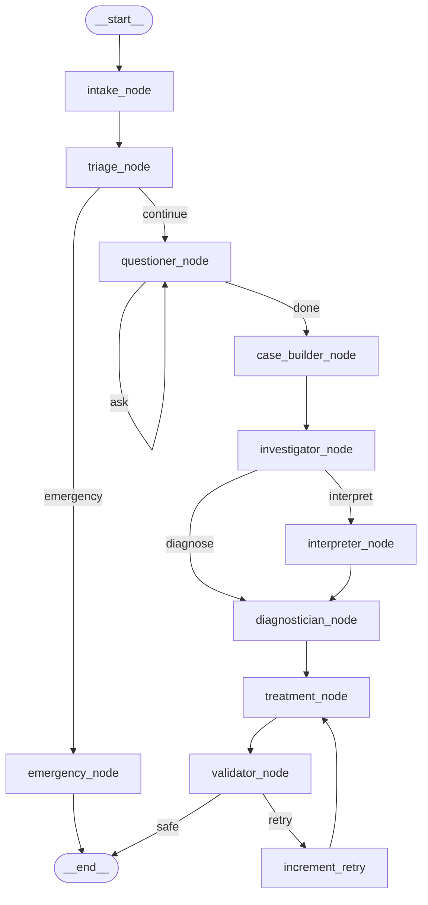

# MedGraph Architecture

## Overview

MedGraph is a multi-agent medical reasoning system built on **LangGraph** — a
production-grade graph execution framework for stateful, multi-step AI workflows.

The system implements a complete clinical pipeline with 9 specialised reasoning
nodes, conditional routing, and a human-in-the-loop Q&A cycle.

---

## Why LangGraph?

| Feature | CrewAI (original) | LangGraph (new) |
|---|---|---|
| State management | Global mutable `PatientState` | Immutable `TypedDict` per invocation |
| Branching | Fixed sequential order | Conditional edges + router functions |
| Q&A loop | Commented out / broken | First-class graph cycle |
| Emergency routing | Heuristic post-processing | Dedicated router → early exit |
| Session isolation | Race condition (1 global state) | `MemorySaver` + `thread_id` per session |
| Streaming | Not supported | `astream_events()` out of the box |
| Observability | Print statements | Full LangGraph tracing + checkpoints |

---

## State Schema (`MedicalState`)

The entire session lives in a single `TypedDict`. Every node receives the
current state and returns a *partial update* — LangGraph merges it immutably.

```python
class MedicalState(TypedDict, total=False):
    # Session
    session_id: str
    patient_input: str

    # Intake
    demographics: DemographicsDict
    symptoms: list[SymptomDict]
    history: list[HistoryItem]

    # Triage
    triage_level: str           # emergency | urgent | routine
    suspected_domains: list[str]
    is_emergency: bool

    # Adaptive Q&A
    current_question: Optional[str]
    qa_pairs: Annotated[list[QAPair], operator.add]   # append-only
    question_round: int
    question_complete: bool

    # Clinical
    case_summary: str
    investigations: list[InvestigationEntry]
    image_paths: list[str]
    image_analysis: str

    # Diagnosis
    differential_diagnosis: list[DiagnosisEntry]
    primary_diagnosis: Optional[str]
    diagnosis_confidence: float

    # Treatment
    medications: list[MedicationEntry]
    procedures: list[dict]
    lifestyle_modifications: list[str]
    follow_up: str
    monitoring: list[str]
    treatment_retry_count: int

    # Validation
    is_safe: bool
    validation_warnings: Annotated[list[ValidationWarning], operator.add]
```

**Key design:** `Annotated[list, operator.add]` fields are *append-only* —
multiple nodes can safely append without overwriting each other, making the
system thread-safe.

---

## Graph Topology



---

## Node Descriptions

### 1. `intake_node`
**Role:** Extract structured data from free-text patient input.

**Input:** `patient_input` (raw text)  
**Output:** `demographics`, `symptoms`, `history`  
**LLM config:** temperature=0.1, low tokens (facts only)

Uses a strict Pydantic output schema to ensure consistent structured extraction.

---

### 2. `triage_node`
**Role:** Assess urgency and identify medical domains.

**Input:** All intake data  
**Output:** `triage_level`, `suspected_domains`, `is_emergency`

**Two-layer safety:**
1. Rule-based keyword scan (fast, no LLM) — catches obvious emergencies
2. LLM-based assessment — nuanced triage reasoning
3. Escalation logic: if rule-check says "urgent" but LLM says "routine", escalate

**Router:** `triage_router` → `"emergency"` or `"continue"`

---

### 3. `emergency_node`
**Role:** Handle critical cases with immediate guidance.

Terminates the graph early with a structured emergency response. Does NOT
run the full diagnostic pipeline — speed is more important than thoroughness
for emergencies.

---

### 4. `questioner_node` ⟳
**Role:** Adaptive clinical interviewer.

Asks ONE high-value question per round. The graph loops back to this node
until either:
- The LLM decides sufficient information exists (`next_question=null`)
- `MAX_QUESTION_ROUNDS` is reached (configurable, default: 5)

**Router:** `questioner_router` → `"ask"` (loop) or `"done"` (proceed)

In the API, the graph is interrupted here for human input via
`POST /sessions/{id}/respond`.

---

### 5. `case_builder_node`
**Role:** Synthesise all collected data into a clinical narrative.

Combines demographics, symptoms, history, triage, and Q&A answers into
a coherent case summary with key findings and clinical correlations.

---

### 6. `investigator_node`
**Role:** Recommend diagnostic tests and imaging.

**Router:** `investigator_router` → `"interpret"` (if images uploaded) or `"diagnose"`

---

### 7. `interpreter_node` (conditional)
**Role:** Analyse uploaded medical images.

Only executed if `image_paths` is populated. Generates a structured text
analysis of findings for downstream diagnosis.

---

### 8. `diagnostician_node`
**Role:** Generate differential diagnosis.

Produces a ranked list of 3-5 conditions with probability estimates, ICD codes,
and supporting evidence — considering all available information.

---

### 9. `treatment_node` ⟳
**Role:** Create comprehensive treatment plan.

On retry (triggered by validator failure), receives the validation warnings
as context and revises the plan accordingly.

---

### 10. `validator_node`
**Role:** Safety and consistency review.

**Two layers:**
1. Rule-based pre-check: missing follow-up, dangerous patterns, insulin without diabetes
2. LLM review: drug interactions, contraindications, guideline compliance

**Router:** `validator_router`
- `"safe"` → END
- `"retry"` → loop back to treatment (up to `MAX_TREATMENT_RETRIES`)
- After max retries: proceed with warnings rather than infinite loop

---

## LLM Configuration

All LLM access goes through `medgraph.llm.get_llm(task_type)`:

```python
from medgraph.llm import get_llm

llm = get_llm("triage")     # temperature=0.0 (deterministic)
llm = get_llm("diagnosis")  # temperature=0.1, max_tokens=2048
```

**Auto-detection:**
1. Probe Ollama for MedGemma availability (cached at startup)
2. If available → `ChatOllama(model="medgemma1.5")`
3. If not → `ChatOpenAI(model="gpt-4o-mini")` (requires `OPENAI_API_KEY`)

---

## API Design

### Session Lifecycle
```
POST /sessions          → start session, runs intake + triage
GET  /sessions/{id}     → check status and current question
POST /sessions/{id}/respond → submit answer to Q&A question
POST /sessions/{id}/images  → declare image paths
GET  /sessions/{id}/report  → get final report (when complete)
DELETE /sessions/{id}   → clean up
```

### Session Isolation
Each API session maps to a LangGraph `thread_id`. All state is stored in the
`MemorySaver` checkpointer keyed by this thread. There is **no global mutable
state** — concurrent sessions cannot interfere.

### Human-in-the-Loop
```
graph.ainvoke(state, {"configurable": {"thread_id": session_id}})
  → pauses at questioner_node if question pending
  → returns current_question to API

# User submits answer:
graph.aupdate_state(config, {"qa_pairs": [qa_entry], "current_question": None})
graph.ainvoke(None, config)  # resume
```

---

## Directory Structure

```
medgraph/
├── src/medgraph/
│   ├── __init__.py          # Package entrypoint
│   ├── config.py            # Pydantic-settings configuration
│   ├── state.py             # MedicalState TypedDict
│   ├── llm.py               # LLM factory (Ollama/OpenAI)
│   ├── prompts.py           # All system prompts
│   ├── safety.py            # Rule-based safety validators
│   ├── graph.py             # StateGraph builder + compiler
│   ├── cli.py               # Rich-powered interactive CLI
│   ├── nodes/
│   │   ├── _utils.py        # Shared parsing + context utilities
│   │   ├── intake.py        # Intake node
│   │   ├── triage.py        # Triage node + router
│   │   ├── emergency.py     # Emergency node
│   │   ├── questioner.py    # Q&A node + router
│   │   ├── case_builder.py  # Case synthesis node
│   │   ├── investigator.py  # Investigation node + router
│   │   ├── interpreter.py   # Image interpreter node
│   │   ├── diagnostician.py # Diagnosis node
│   │   ├── treatment.py     # Treatment node
│   │   └── validator.py     # Validator node + router
│   ├── tools/
│   │   └── drug_checker.py  # LangChain drug interaction tool
│   └── api/
│       ├── app.py           # FastAPI application
│       ├── models.py        # API request/response schemas
│       └── routes.py        # Route handlers
├── tests/
│   ├── test_nodes.py        # Node unit tests (mocked LLM)
│   ├── test_graph.py        # Graph structure tests
│   └── test_api.py          # API endpoint tests
├── docs/
│   └── architecture.md     # This document
├── pyproject.toml
├── README.md
└── .env.example
```
